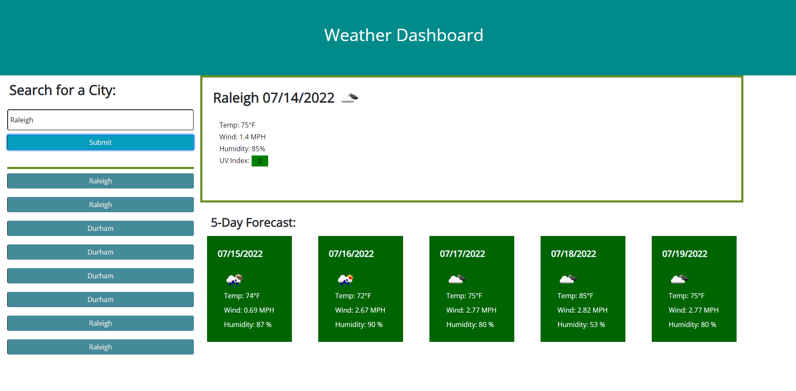

"# weather-dashboard" 
# Description:
## Weather Dashboard pulls weather data from locations requested. City names provided are georeferenced to lat/long values for the API to utilize.
 

### Within this website, there will be 'Weather Dashboard' as the header.

### Below the header will be two main sections: Search for a City and Results
### Once a city has been typed and submitted, the current weather data for that city will appear on the right with the 5-day forcast below.
#### The UV index for the current weather will change color based on risk.
### Previously searched will appear below the search button. Once clicked, the weather data will be rerun for that city.
 

# Screenshot Below:

 
 

# URL Links:
 
## Weather Dashboard: https://morganegilbert.github.io/weather-dashboard/
